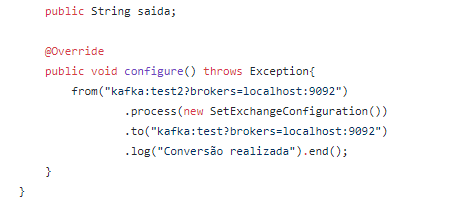
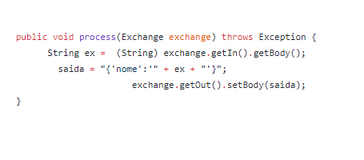

# Exemplo simples de troca de mensagens entre Kafika Topicos

 

## Pré-requisitos
* Apache Kafka 
* Java 8
* Apache Camel 

Obs: O Kafka pode ser baixado no seguinte link: https://kafka.apache.org/downloads.
o Camel neste: https://camel.apache.org/download/ 

### Em que consiste este teste ? 

Troca de mensagem entre dois tópicos do Kafka roteados pele apache Camel, implementação utilizado Java 8.

* Após baixar o Kafka use este comando para criar o tópico:
$ kafka-topics --zookeeper 127.0.0.1:2181 --create --topic `Nome_do_seu_topico` --partition 3 --replication-factor 1

#### Sobre o Camel: 

* Na imagem abaixo é possível ver a implementação java do apache Camel, no trecho `from("kafka:test2?brokers=localhost:9092")`, é definida a entrada de dados com a propriedade `from` do camel.

* em seguida vem o seguinte trecho de código `.process(new SetExchangeConfiguration())`, a propriedade `process` define o método usado para processar a chegada de dados recebida na propriedade `from`, neste exemplo o método se chama `SetExchangeConfiguration()`.

* Depois de processar as informações é feito um retorno utilizado a propriedade `to` do Camel a trecho responsável por isso é seguinte: 
`.to("kafka:test?brokers=localhost:9092")`.

  

##### Entendo o processamento de dados com o Apache Camel: 

* Como já mencionado o processamento de dados é feito no método `SetExchangeConfiguration()`. 

* a troca de informação é feita por um parâmetro do Camel chamado `Exchange`, então `exchange.getIn().getBody()`, pega os dados do body dos dados de chagada. 

* já o `getOut()` equivale a saída de informações, desta maneira o trecho `exchange.getOut().setBody(saida);` faz a saída de dados. 

segue imagem exemplo logo a baixo: 

  

